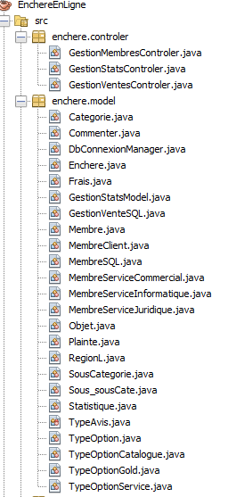

# ABOUT PROJECT
#### [ Enchères en Ligne ] Développement d'une application en Java : Application des enchères en ligne (Inscription, Connexion, Gestion des membres, Gestion des ventes, Gestion des statistiques  *( 2021.10.14 ~ 2021.10.21 )*

## 1. Membres de l'équipe

|*Members*|*Contact*|
|:---:|---|
|**Joohyun ANN**| |
|**Tong LIU**| |
|**Annie DAGO**| |

## 2. Installation du projet
1. Copier Code Github 
2. Import Projet
3. Connexion DB to MySQL
   1. Exécution SQL (DB.sql)
   2. Adapation de connexionBD.php
      1. dbname
      2. username
      3. password
4. Exécution de l'application
   
## 3. Présentation du projet
Afin de répondre aux besoins exprimés de client, qui souhaite avoir une application des enchères en ligne, nous avons réalisé la modélisation et la programmation de l'application "Enchères en Ligne". Ce projet a été accompagné des enseignants de la formation M2 MIAGE IPM.  

&nbsp; Nous avons donc modélisé et réalisé une application qui permet de **mettre en vente** un objet, **d'enchérir sur un objet en vente**, ainsi que de **s'inscrire, se connecter, et les autres fonctionnalités adaptées aux types de l'utilistaeur**.

## 4. Technologie
UML 
Java 
Java Swing 
MySQL 

## 5. Modélisation DCL

 

## 5. Structure du système (MVC pattern)

 

 

# Results
## 1. Résultat
### *Gestion des Membres*
.gif)
 

---

 
&nbsp; **Connexion**, **Consulter les enchères en cours**, **Enchérir sur un objet**, **Consulter mes participations**

---

 
&nbsp; **Connexion**, **Consulter les enchères en cours**, **Consulter les statistiques**

---

 
&nbsp; **Inscription*

### *Gestion des Ventes*

 
&nbsp; **EncherirClient**

---

 
&nbsp; **MiseEnVenteMembre**
Se connecter étant que « membre », réaliser une mise en vente

 
&nbsp; **MiseEnVenteMembrePlus**
Se connecter en tant que « membre plus », réaliser une mise en Vente

---

### *Gestion des Statistiques*

 
&nbsp; **ConsultationStats*

---

## 2. Défis
 - **Modélisation** : 
 - Diagramme de Classe prévu
 
 
 - Diagramme de Classe réalisé
 [DCLActuel](img/DCLActuel.jpg)
 
    &nbsp;La base de données devait au mieux représenter les informations par rapport au **besoin exprimé**, qui était donc de mettre en place un site fonctionnel et interactif entre les propriétaires de chiens et des gardiens, professionnels ou particuliers, ou d'autres propriétaires. Il a donc fallu **reflechir à la structure** de la Base de Données afin de pouvoir enregistrer chaque information nécessaire à **l'exploitation et le lien au site web.**
  En effet, ne connaissant que peu de langages de Bases de Données, nous avons tout d'abord dû décider duquel utiliser afin de faciliter au plus la connexion avec le Site web. Ayant choisi **MySQL Workbench**, nous nous sommes rapidement lancés dans sa création. Mysql est similaire à Oracle, mais le langage n'est pas pas exactement le même. La difficulté était donc d'adapter nos scripts dans le bon langage, par apprentissage numérique de ce dernier et de son environnement. En raison du manque de cours MySQL clairs, certains problèmes sont survenus pendant ce processus de conversion.  Par la suite, une **insertion de données** dans la BD était nécessaire par rapport aux informations qui devaient être présents sur le site, notamment ceux des chenils. Pour cela, nous avons utilisé l'outil "web scaper" pour obtenir des données. La plus part du temps, les bases de données n’était pas accessibles et il fallait passer par l’administrateur du site pour pouvoir récolter les données. Néanmoins, pour certains sites Web, ses sections sont reguliers, et l'acquisition de données est autorisé et facile. Cependant, certains sites Web ont des sections confus alors on ne peut pas utiliser le "web scraper" pour **obtenir automatiquement des données**. Cela nous oblige à les **compléter manuellement**, ce qui prend beaucoup de temps. Un autre problème rencontré était par rapport à **l'abondance et répétitions de donées** entre différents sites Web, Cela nous oblige à les trier et à les filtrer manuellement.  Finalement, par la mise en place d'un groupe interdisciplinaire et grâce à l’implication de chacun, nous avons réussi à mettre en place une base de données facile à gérer, favorisant la transparence et la qualité de l’information.  

 - **Base de données** : 
    &nbsp;La base de données devait au mieux représenter les informations par rapport au **besoin exprimé**, qui était donc de mettre en place un site fonctionnel et interactif entre les propriétaires de chiens et des gardiens, professionnels ou particuliers, ou d'autres propriétaires. Il a donc fallu **reflechir à la structure** de la Base de Données afin de pouvoir enregistrer chaque information nécessaire à **l'exploitation et le lien au site web.**
  En effet, ne connaissant que peu de langages de Bases de Données, nous avons tout d'abord dû décider duquel utiliser afin de faciliter au plus la connexion avec le Site web. Ayant choisi **MySQL Workbench**, nous nous sommes rapidement lancés dans sa création. Mysql est similaire à Oracle, mais le langage n'est pas pas exactement le même. La difficulté était donc d'adapter nos scripts dans le bon langage, par apprentissage numérique de ce dernier et de son environnement. En raison du manque de cours MySQL clairs, certains problèmes sont survenus pendant ce processus de conversion.  Par la suite, une **insertion de données** dans la BD était nécessaire par rapport aux informations qui devaient être présents sur le site, notamment ceux des chenils. Pour cela, nous avons utilisé l'outil "web scaper" pour obtenir des données. La plus part du temps, les bases de données n’était pas accessibles et il fallait passer par l’administrateur du site pour pouvoir récolter les données. Néanmoins, pour certains sites Web, ses sections sont reguliers, et l'acquisition de données est autorisé et facile. Cependant, certains sites Web ont des sections confus alors on ne peut pas utiliser le "web scraper" pour **obtenir automatiquement des données**. Cela nous oblige à les **compléter manuellement**, ce qui prend beaucoup de temps. Un autre problème rencontré était par rapport à **l'abondance et répétitions de donées** entre différents sites Web, Cela nous oblige à les trier et à les filtrer manuellement.  Finalement, par la mise en place d'un groupe interdisciplinaire et grâce à l’implication de chacun, nous avons réussi à mettre en place une base de données facile à gérer, favorisant la transparence et la qualité de l’information.  

    
- **Application** : 
    
    &nbsp;Notre objectif était de créer cette application qui réponde à tous les besoins d'utilisateurs. Etant donné qu'il y avait quatres types d'acteurs différents qui ont un rôle différent, il était difficile de réaliser toutes les fonctionnalités à cause du manque du temps. Cependant, ce projet nous a permis de bien apprendre l'utilisation de **l'héritage de Java** et cela nous a facilité de nombreuses tâches lors de la connexion, pour proposer des fonctionnalités différentes. Ensuite, le **Design Pattern MVC** était, au début, pas très facile d'utiliser surtout que nous avions des membres qui n'ont jamais eu d'expérience de programmer de A à Z sur cette structure. Mais,au fur et à mesure de la réalisation du projet, nous avons pu bien répartir nos tâches et grâce à ce pattern, il n'y a pas eu grande difficulté de rassembler les codes de chacun. Enfin, la technologie Swing de Netbeans était intéressante à pratiquer même si nous avons pas pu prendre beaucoup de temps à créer une interface d'un niveau plus élevé. Enfin, la collaboration lors dela programmation n'est toujours pas facile mais grâce à **Git, MVC Pattern, et l'étape de lamodélisation**, nous avons pu réalisé la majorité des fonctionnalités. 
    

